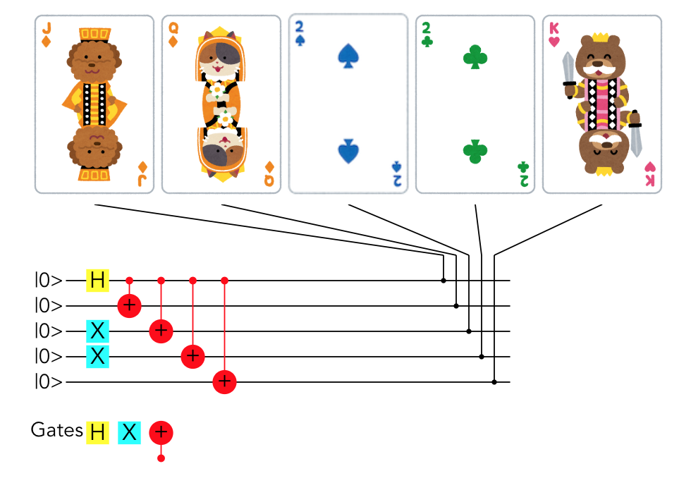

# qoker
This is implementation of quantum video poker. 

In classical video poker, one has to choose hand or swap for each cards.
If we assign hold to 0 and swap to 1, hold or swap decisicion can be described with classical digital circuit.
We extend this situation to quantum one.
In qunatum computer, we can obtain superposition of 0(=hold) and 1(=swap).
The score is calculated from average of measurements.

This project uses qramana(https://github.com/qramana/qramana).

## Project setup
```
yarn install
```

### Compiles and hot-reloads for development
```
yarn serve
```

### Compiles and minifies for production
```
yarn build
```

### Run your unit tests
```
yarn test:unit
```

### Run your end-to-end tests
```
yarn test:e2e
```

### Lints and fixes files
```
yarn lint
```

### Customize configuration
See [Configuration Reference](https://cli.vuejs.org/config/).
